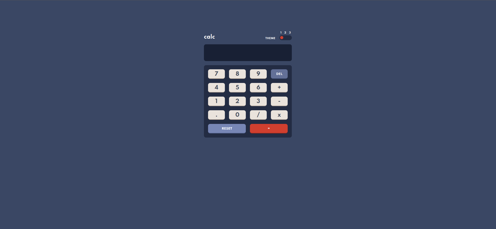

# Front-end Mentor Calculator App

This was a project using vanilla JavaScript and Webpack to create a simple calculator!

I learned a lot with this project and practice my pure javascript skills.



## How to run the project

You can see the live version of the project [here](https://liverday-calculator.netlify.app/) or you can run it locally cloning the reposritory

### Installing the dependencies

Run the following command

```
$ yarn install
```

### Running webserver

Run the following command

```
$ yarn serve
```

This script will start a server on 8080 port, and you can access on `http://localhost:8080`